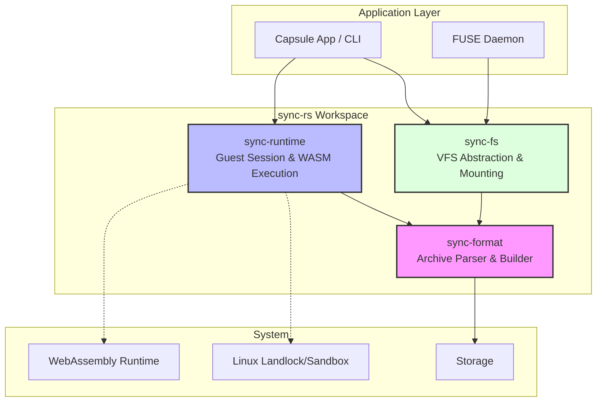
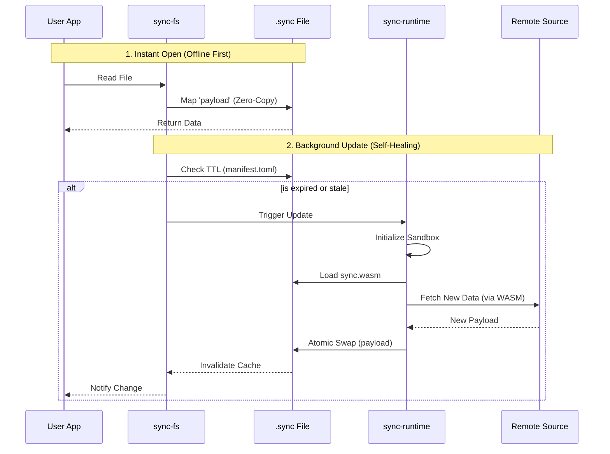

<div align="center">
  
  
  # sync-rs

  **The Self-Updating Archive**: Rust implementation of the `.sync` format for intelligent, self-healing data containers.
</div>

## Overview

`sync-rs` is a modular Rust workspace for handling `.sync` archives - a standardized format that combines:

- **Zero-Copy Data Access**: Instant file operations with no extraction overhead
- **Self-Updating Logic**: Embedded WASM modules that refresh data autonomously
- **Sandboxed Execution**: Policy-driven permission model with OS-level isolation
- **ZIP-Compatible Storage**: Standard ZIP container with specialized structure

Perfect for offline-first applications, edge computing, and scenarios requiring data with built-in update intelligence.

---

## Architecture

The workspace is organized into three focused crates with clear separation of concerns:



---

## Crates

### `sync-format` (Core)
**Responsibility**: `.sync` (ZIP) archive reading/writing, `manifest.toml` parsing, signature verification

- **Dependencies**: Minimal (zip, serde, toml, blake3) - no WASM runtime or OS-specific features
- **Use case**: Portable across all environments (WASM, server-side, embedded, no_std compatible)
- **Key Features**:
  - Zero-allocation payload access via `Stored` (uncompressed) ZIP entries
  - Manifest validation with TTL and permission checks
  - Incremental builder for creating/updating archives

### `sync-runtime` (Host)
**Responsibility**: `GuestSession` management, WASM execution, sandbox control

- **Dependencies**: sync-format + OS-specific features (landlock on Linux, etc.)
- **Use case**: Host applications that need to execute guest WASM modules
- **Key Features**:
  - Permission-based execution model (`Owner`, `Member`, `Public`)
  - Widget bounds and UI constraints
  - Policy enforcement before WASM execution

### `sync-fs` (VFS/WebDAV)
**Responsibility**: Virtual filesystem abstraction, exposing `.sync` payloads as files

- **Dependencies**: sync-format + WebDAV server (dav-server, hyper, tokio)
- **Use case**: Mounting `.sync` archives as network drives via WebDAV
- **Key Features**:
  - Display name generation from manifest metadata
  - Read-only mount configuration
  - Extension-aware path generation
  - **WebDAV Server**: Mount `.sync` files directly in Finder (macOS), Explorer (Windows), or file manager (Linux)
  - **Zero-Copy Reads**: Uses `pread()` for instant data access without extraction
  - **No Kernel Extensions**: Works on Apple Silicon without any special setup

---

## Anatomy of a `.sync` File

A `.sync` archive is a standard ZIP file with a specific internal structure designed for zero-copy access and self-update capabilities:

```
┌─────────────────────────────────────────────────────────┐
│         report.csv.sync (ZIP Archive)                   │
├─────────────────────────────────────────────────────────┤
│                                                         │
│  manifest.toml                                         │
│      ├─ Metadata (name, description, TTL)              │
│      ├─ Ownership (creator, team)                      │
│      ├─ Permissions (read, write, execute)             │
│      └─ Policy (network scope, update rules)           │
│                                                         │
│  payload (STORED / No Compression)                     │
│      └─ RAW DATA - Zero-Copy Access via VFS           │
│                                                         │
│  sync.wasm (Optional)                                  │
│      └─ Update Logic - Executed in Sandbox            │
│                                                         │
│  context.json (Optional)                               │
│      └─ Context Parameters for WASM execution          │
│                                                         │
└─────────────────────────────────────────────────────────┘
```

**Key Design Choices**:
- **Payload is Stored**: No decompression needed → instant access
- **Manifest is Compressed**: Small size, read once at mount time
- **WASM is Optional**: Not all archives need self-update capability

---

## Data Flow & Lifecycle

How a `.sync` file provides instant access while staying up-to-date in the background:



---

## Quick Start

### Building the Workspace

```bash
# Build all crates
cargo build --workspace

# Run tests
cargo test --workspace

# Check formatting and lints
cargo fmt --all -- --check
cargo clippy --all-targets --all-features -- -D warnings
```

### Using `sync-format`

```rust
use sync_format::{SyncArchive, SyncBuilder, SyncManifest};
use std::path::Path;

// Open an existing archive
let archive = SyncArchive::open("example.sync")?;
let manifest = archive.manifest();
println!("Archive: {}", manifest.metadata.name);

// Read the payload
let payload = archive.read_payload()?;

// Create a new archive
SyncBuilder::new()
    .with_manifest(manifest.clone())
    .with_payload_bytes(b"hello world")
    .with_wasm_bytes(b"\0asm\x01\0\0\0")
    .write_to("new.sync")?;
```

### Using `sync-runtime`

```rust
use sync_runtime::{GuestSession, GuestAction};

// Create a guest session
let mut session = GuestSession::new("example.sync".into())?;

// Set permissions
session.as_owner()?;
session.grant_wasm_execution()?;

// Execute WASM update logic
let response = session.execute_wasm()?;
match response.action {
    GuestAction::UpdatePayload(new_data) => {
        println!("Updated with {} bytes", new_data.len());
    }
    _ => {}
}
```

### Using `sync-fs`

```rust
use sync_format::SyncArchive;
use sync_fs::{VfsMount, VfsMountConfig};
use std::path::PathBuf;

// Mount an archive to VFS
let archive = SyncArchive::open("example.sync")?;
let config = VfsMountConfig {
    mount_path: PathBuf::from("/mnt"),
    expose_as_read_only: true,
    show_original_extension: true,
};
let mount = VfsMount::from_archive(&archive, config)?;

// List virtual entries
for entry in mount.entries() {
    println!("{}: {}", entry.display_name, entry.vfs_path.display());
}
```

### FUSE Mounting (Open in Finder)

> **⚠️ Deprecated**: FUSE approach requires kernel extensions on macOS (macFUSE) which need
> special setup on Apple Silicon Macs. Use the **WebDAV approach** below instead.

### WebDAV Mounting (Recommended)

Mount `.sync` archives via a local WebDAV server. This works on **all platforms without any additional software**.

#### Prerequisites

**None required!** WebDAV is natively supported on macOS, Windows, and Linux.

#### Building

```bash
# Build the sync-mount CLI
cargo build --package sync-fs --features cli --release

# The binary will be at:
# target/release/sync-mount
```

#### Usage

```bash
# Start WebDAV server (default port 4918)
./target/release/sync-mount data.sync

# Or specify a custom port
./target/release/sync-mount data.sync --port 8080

# Writable mode: store uploads as .sync files in a directory
./target/release/sync-mount --writable ./sync-store
```

#### Writable WebDAV (Sync Store)

Writable mode exposes a directory-backed WebDAV share. Files you drop into the
mount are automatically wrapped into `.sync` archives in the store directory.
Overwriting a file updates the existing `.sync` payload.

```bash
# Start writable WebDAV server (directory is created if missing)
./target/release/sync-mount --writable ./sync-store --port 4919

# Resulting archives:
# ./sync-store/report.pdf.sync
# ./sync-store/notes.md.sync
```

Then mount in Finder:

1. Open Finder
2. Press **Cmd+K** (Go → Connect to Server)
3. Enter: `http://localhost:4918`
4. Click **Connect**

The `.sync` file contents will appear as a mounted network drive!

#### From Terminal (macOS)

```bash
# Mount using mount_webdav
mkdir -p /tmp/sync-mount
mount_webdav http://localhost:4918 /tmp/sync-mount

# Now access the files
open /tmp/sync-mount/data.xlsx
```

#### Programmatic WebDAV Server

```rust
use sync_fs::webdav::serve;
use sync_fs::{VfsMount, VfsMountConfig};
use sync_format::SyncArchive;

#[tokio::main]
async fn main() -> std::io::Result<()> {
    let archive = SyncArchive::open("data.sync").unwrap();
    let vfs = VfsMount::from_archive(&archive, VfsMountConfig::default()).unwrap();
    
    // Start server on port 4918 (blocks until Ctrl+C)
    serve("data.sync", vfs, 4918).await
}
```

#### Programmatic Writable WebDAV Server

```rust
use sync_fs::webdav::serve_writable;

#[tokio::main]
async fn main() -> std::io::Result<()> {
    // Start server on port 4918 (blocks until Ctrl+C)
    serve_writable("./sync-store", 4918).await
}
```

#### Background Server for Applications

```rust
use sync_fs::webdav::serve_background;
use sync_fs::{VfsMount, VfsMountConfig};
use sync_format::SyncArchive;

#[tokio::main]
async fn main() -> std::io::Result<()> {
    let archive = SyncArchive::open("data.sync").unwrap();
    let vfs = VfsMount::from_archive(&archive, VfsMountConfig::default()).unwrap();
    
    // Start server in background (returns immediately)
    let server = serve_background("data.sync", vfs, 0).await?;
    
    println!("Server running at {}", server.mount_url());
    
    // Do other work...
    
    // Shutdown when done
    server.shutdown();
    Ok(())
}
```

#### Background Writable Server for Applications

```rust
use sync_fs::webdav::serve_writable_background;

#[tokio::main]
async fn main() -> std::io::Result<()> {
    let server = serve_writable_background("./sync-store", 0).await?;
    println!("Server running at {}", server.mount_url());
    server.shutdown();
    Ok(())
}
```

---

## Testing

```bash
# Run all tests
cargo test --workspace

# Run specific crate tests
cargo test --package sync-format
cargo test --package sync-runtime
cargo test --package sync-fs

# Run with output
cargo test -- --nocapture
```

---

## Documentation

Generate and view crate documentation:

```bash
cargo doc --workspace --open
```

---

## Development Workflow

### Before Committing

```bash
# Format code
cargo fmt --all

# Run lints
cargo clippy --all-targets --all-features -- -D warnings

# Run tests
cargo test --workspace

# Build release
cargo build --release --workspace
```

---

## Architecture Decision Records

For detailed architectural rationale, see:

- [Runtime Selection Order ADR](../../docs/adr/2026-01-29_000001_runtime-selection-order.md)
- [Signature Format (JCS) ADR](../../docs/adr/2026-01-29_000002_signature-format-jcs.md)

---

## License

Licensed under either of:

- Apache License, Version 2.0 ([LICENSE-APACHE](LICENSE-APACHE) or http://www.apache.org/licenses/LICENSE-2.0)
- MIT license ([LICENSE-MIT](LICENSE-MIT) or http://opensource.org/licenses/MIT)

at your option.

---

## Contributing

Contributions are welcome! Please follow the Rust code style guidelines and ensure all tests pass before submitting a pull request.
