<div align="center">
  
  
  # sync-rs

  **The Self-Updating Archive**: Rust implementation of the `.sync` format for intelligent, self-healing data containers.
</div>

## 🎯 Overview

`sync-rs` is a modular Rust workspace for handling `.sync` archives - a standardized format that combines:

- ✨ **Zero-Copy Data Access**: Instant file operations with no extraction overhead
- 🔄 **Self-Updating Logic**: Embedded WASM modules that refresh data autonomously
- 🔒 **Sandboxed Execution**: Policy-driven permission model with OS-level isolation
- 📦 **ZIP-Compatible Storage**: Standard ZIP container with specialized structure

Perfect for offline-first applications, edge computing, and scenarios requiring data with built-in update intelligence.

---

## 🏗️ Architecture

The workspace is organized into three focused crates with clear separation of concerns:

```mermaid
graph TD
    subgraph "Application Layer"
        App[🚀 Capsule App / CLI]
        FUSE[💾 FUSE Daemon]
    end

    subgraph "sync-rs Workspace"
        Runtime[⚙️ sync-runtime<br/>Guest Session & WASM Execution]
        FS[📂 sync-fs<br/>VFS Abstraction & Mounting]
        Format[📦 sync-format<br/>Archive Parser & Builder]
    end

    subgraph "System"
        WASM[WebAssembly Runtime]
        LSM[Linux Landlock/Sandbox]
        Disk[📁 Storage]
    end

    App --> Runtime
    App --> FS
    FUSE --> FS
    
    Runtime --> Format
    FS --> Format
    
    Runtime -.-> WASM
    Runtime -.-> LSM
    Format --> Disk
    
    style Format fill:#f9f,stroke:#333,stroke-width:2px
    style Runtime fill:#bbf,stroke:#333,stroke-width:2px
    style FS fill:#dfd,stroke:#333,stroke-width:2px
```



---

## 📦 Crates

### `sync-format` (Core)
**Responsibility**: `.sync` (ZIP) archive reading/writing, `manifest.toml` parsing, signature verification

- **Dependencies**: Minimal (zip, serde, toml, blake3) - no WASM runtime or OS-specific features
- **Use case**: Portable across all environments (WASM, server-side, embedded, no_std compatible)
- **Key Features**:
  - Zero-allocation payload access via `Stored` (uncompressed) ZIP entries
  - Manifest validation with TTL and permission checks
  - Incremental builder for creating/updating archives

### `sync-runtime` (Host)
**Responsibility**: `GuestSession` management, WASM execution, sandbox control

- **Dependencies**: sync-format + OS-specific features (landlock on Linux, etc.)
- **Use case**: Host applications that need to execute guest WASM modules
- **Key Features**:
  - Permission-based execution model (`Owner`, `Member`, `Public`)
  - Widget bounds and UI constraints
  - Policy enforcement before WASM execution

### `sync-fs` (VFS/FUSE)
**Responsibility**: Virtual filesystem abstraction, exposing `.sync` payloads as files

- **Dependencies**: sync-format + filesystem abstractions
- **Use case**: Mounting `.sync` archives as virtual files, future FUSE integration
- **Key Features**:
  - Display name generation from manifest metadata
  - Read-only mount configuration
  - Extension-aware path generation

---

## 🔬 Anatomy of a `.sync` File

A `.sync` archive is a standard ZIP file with a specific internal structure designed for zero-copy access and self-update capabilities:

```
┌─────────────────────────────────────────────────────────┐
│         report.csv.sync (ZIP Archive)                   │
├─────────────────────────────────────────────────────────┤
│                                                         │
│  📄 manifest.toml                                       │
│      ├─ Metadata (name, description, TTL)              │
│      ├─ Ownership (creator, team)                      │
│      ├─ Permissions (read, write, execute)             │
│      └─ Policy (network scope, update rules)           │
│                                                         │
│  📦 payload (STORED / No Compression)                   │
│      └─ ✨ RAW DATA - Zero-Copy Access via VFS         │
│                                                         │
│  🔧 sync.wasm (Optional)                                │
│      └─ 🔒 Update Logic - Executed in Sandbox          │
│                                                         │
│  📋 context.json (Optional)                             │
│      └─ Context Parameters for WASM execution          │
│                                                         │
└─────────────────────────────────────────────────────────┘
```

**Key Design Choices**:
- **Payload is Stored**: No decompression needed → instant access
- **Manifest is Compressed**: Small size, read once at mount time
- **WASM is Optional**: Not all archives need self-update capability

---

## 🔄 Data Flow & Lifecycle

How a `.sync` file provides instant access while staying up-to-date in the background:

```mermaid
sequenceDiagram
    participant App as User App
    participant VFS as sync-fs
    participant Archive as .sync File
    participant Runtime as sync-runtime
    participant Cloud as Remote Source

    Note over App, Archive: 1️⃣ Instant Open (Offline First)
    App->>VFS: Read File
    VFS->>Archive: Map 'payload' (Zero-Copy)
    Archive-->>App: Return Data

    Note over VFS, Cloud: 2️⃣ Background Update (Self-Healing)
    VFS->>Archive: Check TTL (manifest.toml)
    alt is expired or stale
        VFS->>Runtime: Trigger Update
        Runtime->>Runtime: Initialize Sandbox
        Runtime->>Archive: Load sync.wasm
        Runtime->>Cloud: Fetch New Data (via WASM)
        Cloud-->>Runtime: New Payload
        Runtime->>Archive: Atomic Swap (payload)
        Archive-->>VFS: Invalidate Cache
        VFS-->>App: Notify Change
    end
```



---

## 🚀 Quick Start

### Building the Workspace

```bash
# Build all crates
cargo build --workspace

# Run tests
cargo test --workspace

# Check formatting and lints
cargo fmt --all -- --check
cargo clippy --all-targets --all-features -- -D warnings
```

### Using `sync-format`

```rust
use sync_format::{SyncArchive, SyncBuilder, SyncManifest};
use std::path::Path;

// Open an existing archive
let archive = SyncArchive::open("example.sync")?;
let manifest = archive.manifest();
println!("Archive: {}", manifest.metadata.name);

// Read the payload
let payload = archive.read_payload()?;

// Create a new archive
SyncBuilder::new()
    .with_manifest(manifest.clone())
    .with_payload_bytes(b"hello world")
    .with_wasm_bytes(b"\0asm\x01\0\0\0")
    .write_to("new.sync")?;
```

### Using `sync-runtime`

```rust
use sync_runtime::{GuestSession, GuestAction};

// Create a guest session
let mut session = GuestSession::new("example.sync".into())?;

// Set permissions
session.as_owner()?;
session.grant_wasm_execution()?;

// Execute WASM update logic
let response = session.execute_wasm()?;
match response.action {
    GuestAction::UpdatePayload(new_data) => {
        println!("Updated with {} bytes", new_data.len());
    }
    _ => {}
}
```

### Using `sync-fs`

```rust
use sync_format::SyncArchive;
use sync_fs::{VfsMount, VfsMountConfig};
use std::path::PathBuf;

// Mount an archive to VFS
let archive = SyncArchive::open("example.sync")?;
let config = VfsMountConfig {
    mount_path: PathBuf::from("/mnt"),
    expose_as_read_only: true,
    show_original_extension: true,
};
let mount = VfsMount::from_archive(&archive, config)?;

// List virtual entries
for entry in mount.entries() {
    println!("{}: {}", entry.display_name, entry.vfs_path.display());
}
```

---

## 🧪 Testing

```bash
# Run all tests
cargo test --workspace

# Run specific crate tests
cargo test --package sync-format
cargo test --package sync-runtime
cargo test --package sync-fs

# Run with output
cargo test -- --nocapture
```

---

## 📚 Documentation

Generate and view crate documentation:

```bash
cargo doc --workspace --open
```

---

## 🛠️ Development Workflow

### Before Committing

```bash
# Format code
cargo fmt --all

# Run lints
cargo clippy --all-targets --all-features -- -D warnings

# Run tests
cargo test --workspace

# Build release
cargo build --release --workspace
```

---

## 🏛️ Architecture Decision Records

For detailed architectural rationale, see:

- [Runtime Selection Order ADR](../../docs/adr/2026-01-29_000001_runtime-selection-order.md)
- [Signature Format (JCS) ADR](../../docs/adr/2026-01-29_000002_signature-format-jcs.md)

---

## 📜 License

Licensed under either of:

- Apache License, Version 2.0 ([LICENSE-APACHE](LICENSE-APACHE) or http://www.apache.org/licenses/LICENSE-2.0)
- MIT license ([LICENSE-MIT](LICENSE-MIT) or http://opensource.org/licenses/MIT)

at your option.

---

## 🤝 Contributing

Contributions are welcome! Please follow the Rust code style guidelines and ensure all tests pass before submitting a pull request.

---

**Built with ❤️ by the Capsule Project**
