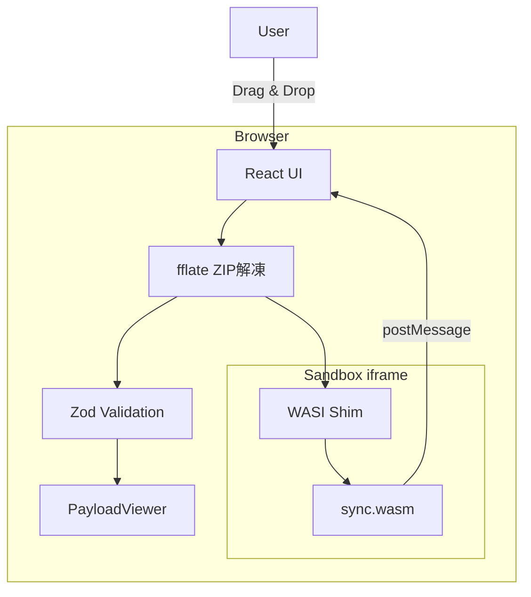

# sync-rs Web Viewer

**ブラウザだけで `.sync` ファイルを実行・閲覧できるビューア**

[](https://www.typescriptlang.org/)
[](https://react.dev/)
[](https://vite.dev/)

## 概要

`web-viewer` は、`.sync` アーカイブをブラウザ内で完全に処理するクライアントサイドアプリケーションです。サーバーへのアップロードは一切不要で、すべての処理がローカルで行われます。

### 特徴

- 🔒 **Zero-Install**: ブラウザだけで動作、インストール不要
- 🛡️ **Sandboxed Execution**: WASM はiframeサンドボックス内で隔離実行
- 📦 **Offline-First**: インターネット接続不要（初回ロード後）
- ⚡ **高速処理**: fflateによる高速ZIP解凍

## 技術スタック

| カテゴリ | 技術 | 理由 |
|---------|------|------|
| フレームワーク | React + TypeScript | 型安全性とato-desktopとの一貫性 |
| ビルドツール | Vite | 高速HMR、ESM対応 |
| スタイリング | Tailwind CSS | ユーティリティファースト |
| ZIPパース | fflate | 高性能(8kB)、ブラウザ完全対応 |
| バリデーション | Zod | ランタイム型検証 |
| iframe通信 | Comlink | 直感的なRPC |
| WASI | @aspect-build/browser_wasi_shim | ブラウザWASI対応 |

## 開発

### セットアップ

```bash
cd apps/sync-rs/web-viewer
pnpm install
pnpm dev
```

### ビルド

```bash
pnpm build
```

### プロジェクト構造

```
web-viewer/
├── src/
│   ├── main.tsx               # エントリポイント
│   ├── App.tsx                # メインコンポーネント
│   ├── components/
│   │   ├── ui/                # 汎用UIコンポーネント
│   │   ├── DropZone.tsx       # ファイルドロップエリア
│   │   ├── ManifestPanel.tsx  # マニフェスト表示
│   │   ├── PayloadViewer.tsx  # ペイロードビューア
│   │   └── WasmPanel.tsx      # WASM実行UI
│   ├── lib/
│   │   ├── sync-parser.ts     # .sync ZIPパーサー
│   │   ├── manifest-schema.ts # Zodスキーマ
│   │   ├── wasm-sandbox.ts    # WASM sandbox制御
│   │   └── content-renderer.ts# content_type別レンダラー
│   ├── types/
│   │   └── sync.ts            # 型定義
│   └── hooks/
│       └── useSyncFile.ts     # .sync読み込みフック
└── sandbox/
    └── wasm-host.html         # iframe用WASM実行環境
```

## .sync ファイル構造

```
file.sync (ZIP Archive)
├── manifest.toml    # メタデータ、ポリシー、パーミッション
├── payload          # データ (非圧縮)
├── sync.wasm        # Optional: 自己更新ロジック
└── context.json     # Optional: WASMコンテキスト
```

## アーキテクチャ



## セキュリティ

- **CSP制限**: WASMはCSP制限付きiframe内で実行
- **ネットワーク隔離**: WASMからの外部通信は禁止
- **メモリ隔離**: WASMメモリはメインスレッドから隔離

## ライセンス

MIT OR Apache-2.0
